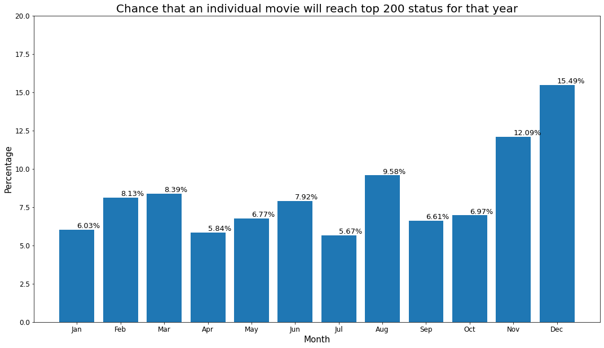
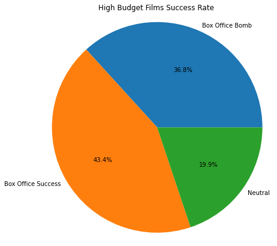
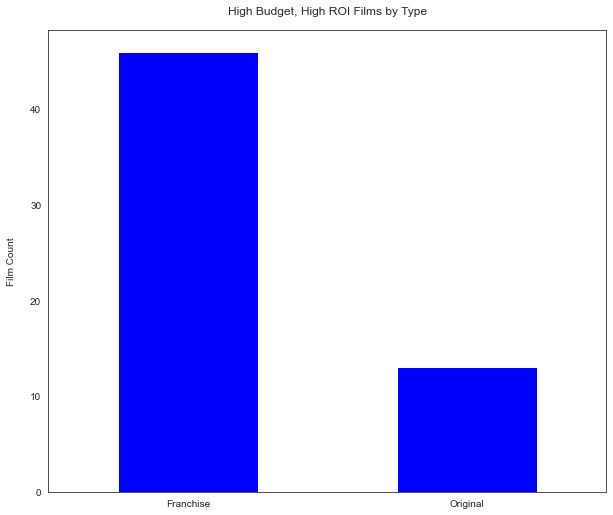

# Microsoft Movie Studio Data Analysis

**Authors**: Dillon Medd, Avi Rubin, Angie Rincon


## Overview

This project explores some of the decisions that Microsoft will have to make as a new competitior in the movie industry. Descriptive analysis of data from box office movies from 2010 - 2019 shows that month of release, genre and established fanbase all have an impact on the revenue a movie generates. The Microsoft Movie Studio can benefit from this analysis to produce movies with high returns on investment. 

## Business Problem

Microsoft sees all the big companies creating original video content and they want to get in on the fun. They have decided to create a new movie studio, but they don’t know anything about creating movies. You are charged with exploring what types of films are currently doing the best at the box office. You must then translate those findings into actionable insights that the head of Microsoft's new movie studio can use to help decide what type of films to create.


## Data

This analysis includes data from the-numbers.com, IMDB.com and scraped from BoxOfficeMojo.com. BoxOfficeMojo.com lists all movie titles and their corresponding release dates as well as gross revenue. The-numbers.com database includes movie titles, production budget as well as domestic and worldwide gross revenue. IMDB provides an overview of information about each movie.


## Methods

This project uses descriptive analysis, broken down by month as well as separated by budget-size and genre. This provides a useful overview of which months, budget-sizes, and genres have resulted in finacial sucesss from 2010-2019.


## Results

## 15.49% of all movies launched in December were top grossing movies.



## 43.4% of movies released with a budget over 1.5 million had an ROI over 250%.



## 45% Of films with an ROI of 1000% since 2010 were horror/thriller.


## Of the high budget films that were a success, 46% were part of a franchise.



## Conclusions and Recommendations

This analysis leads to three recommendations for maximizing Microsoft's profits in the movie industry.

1. Aim to release big movies in December and November. Our analysis shows that movies released in the last two months of the year are more likely to reach top 200 billboard status for the year.
2. Produce a high budget film with an assured audience. If Microsoft decides to make a film with a production budget of $150 Million or more, it should be a sequel of a series that has proven popularity and profitability.
3. Utilize the production of horror/thriller movies. Due to its low budget nature, Horror/Thriller films make up 45% of the films with the highest ROI. It is clearly the genre that can result in the biggest 'bang for your buck.' 


## For More Information

Please review our full analysis in [ROI Genre](./ROI\Genre.ipynb) or our [presentation](./Presentation.pdf).

For any additional questions, please contact:
* Dillon Medd at [dillonmedd1@gmail.com](mailto:dillonmedd@gmail.com) 
* Avi Rubin at [avirubin930@gmail.com](mailto:avirubin930@gmail.com)
* Angie Rincon at [angiekay.rincon@gmail.com](mailto:angiekay.rincon@gmail.com)

## Repository Structure

```

├── README.md                           <- The top-level README for reviewers of this project
├── Movie_Analysis.ipynb   <- Narrative documentation of analysis in Jupyter notebook
├── Movie_Project_Presentation.pdf         <- PDF version of project presentation
├── data                                <- Both sourced externally and generated from code
└── images                              <- Both sourced externally and generated from code
```
